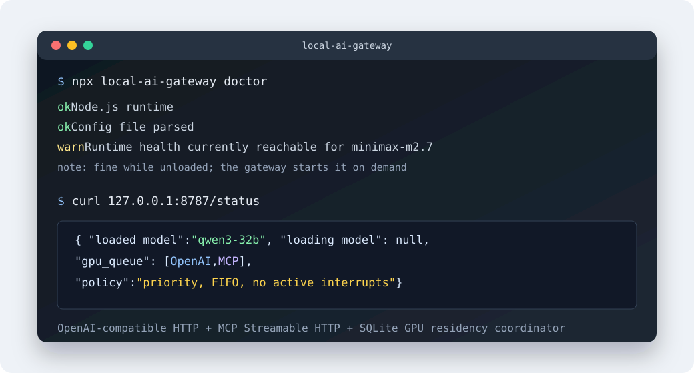
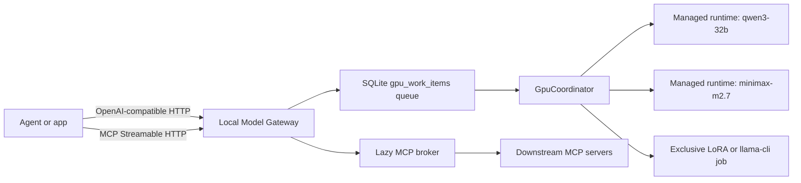

# Local Model Gateway

[](https://github.com/vstep1/local-model-gateway/actions/workflows/ci.yml)
[](LICENSE)
[](package.json)
[](#protocols)

Local Model Gateway is a local-first control plane for running agent workloads on
one workstation GPU.

It exposes a stable OpenAI-compatible API and a Streamable HTTP MCP endpoint,
then puts all GPU-bound work behind one SQLite-backed scheduler. Agents can ask
for Qwen, MiniMax, a LoRA job, or another local runtime through the same gateway
without racing each other, double-loading models, or bypassing load/unload
decisions.



## Why This Exists

Local models are easy to start and hard to coordinate.

Most agent stacks assume "one base URL equals one model." On a real workstation,
that breaks down quickly:

- a 32B model and a 230B MoE model cannot both casually live in memory
- OpenAI-compatible requests and MCP tool calls can hit the same GPU through
  different paths
- manual model start/stop scripts work until an agent retries, hangs, or swaps
  tasks mid-session
- loading every MCP tool schema into an agent prompt wastes context before the
  user asks for any tool

Local Model Gateway gives those moving parts one admission layer.

## What You Get

| Capability | What it does |
| --- | --- |
| OpenAI-compatible API | Drop-in `/v1/chat/completions`, `/v1/responses`, and `/v1/models` routes for local agents. |
| MCP endpoint | Runtime control and setup tools over Streamable HTTP at `/mcp`. |
| Durable GPU queue | SQLite-backed priority/FIFO work admission across URL and MCP entrypoints. |
| Runtime residency | Starts, health-checks, unloads, and swaps managed local runtimes on demand. |
| Launch adapters | macOS launchd and generic shell helpers now, with systemd/Docker planned. |
| Lazy MCP broker | Keeps downstream MCP catalogs out of the prompt until a tool is actually searched or described. |
| Discovery manifest | `/.well-known/local-model-gateway.json` for clients that want model, timeout, and endpoint hints. |

## Architecture



The important design constraint: no managed local GPU request should bypass the
coordinator. OpenAI URL requests, MCP `submit_job` requests, and exclusive
`llama-cli` work all queue through the same admission policy.

## Quick Start

Source install:

```bash
git clone https://github.com/vstep1/local-model-gateway.git
cd local-model-gateway
npm install
npm run build
```

Create a local config and run the first diagnostic:

```bash
npx local-model-gateway init
npx local-model-gateway doctor
```

Start the gateway:

```bash
npx local-model-gateway start
```

Default endpoints:

| Endpoint | URL |
| --- | --- |
| OpenAI-compatible API | `http://127.0.0.1:8787/v1` |
| MCP Streamable HTTP | `http://127.0.0.1:8787/mcp` |
| Status | `http://127.0.0.1:8787/status` |
| Discovery manifest | `http://127.0.0.1:8787/.well-known/local-model-gateway.json` |

Smoke check:

```bash
curl http://127.0.0.1:8787/health
curl http://127.0.0.1:8787/status
curl http://127.0.0.1:8787/v1/models
curl http://127.0.0.1:8787/.well-known/local-model-gateway.json
```

Fresh configs do not enable heavyweight runtimes automatically. `qwen3-32b` and
`minimax-m2.7` presets are generated disabled until you point them at local
runtime service scripts that work on your machine.

## Protocols

### OpenAI-Compatible

Point any OpenAI-compatible client at:

```text
base_url: http://127.0.0.1:8787/v1
api_key: local-model-gateway
model: one of GET /v1/models
```

Example:

```bash
curl http://127.0.0.1:8787/v1/chat/completions \
  -H 'Content-Type: application/json' \
  -d '{
    "model": "qwen3-32b",
    "messages": [
      { "role": "user", "content": "Say hello from the local gateway." }
    ]
  }'
```

### MCP

Connect MCP clients to:

```text
url: http://127.0.0.1:8787/mcp
transport: streamable-http
```

Useful setup and runtime tools:

| Tool | Purpose |
| --- | --- |
| `gateway_status` | Read queue, runtime, and persisted config status. |
| `list_runtime_models` | List managed local runtime aliases and context metadata. |
| `recommend_local_profile` | Pick a local runtime for a target prompt budget. |
| `generate_client_config` | Emit generic OpenAI, generic MCP, or Hermes snippets. |
| `validate_client_config` | Check that a client points at loopback protocol endpoints. |
| `runtime_status` | Inspect active work, loaded model, queued work, and errors. |
| `cancel_runtime_request` | Cancel queued or active runtime work by work item id. |
| `force_unload_runtime` | Admin escape hatch for a stuck runtime. |

## Runtime Coordination

Managed runtimes are local OpenAI-compatible servers controlled by service
scripts. A runtime definition includes a base URL, health URL, start/stop
commands, timeouts, context metadata, and `maxConcurrency`.

Queue rules:

- higher priority wins
- same priority is FIFO
- active work is never interrupted unless explicitly cancelled
- same-model work can share a loaded runtime up to `maxConcurrency`
- different-model work waits until the active model drains, then swaps
- exclusive LoRA work unloads managed runtimes before execution

Built-in presets:

| Alias | Default role | Default state |
| --- | --- | --- |
| `qwen3-32b` | Clean local Qwen3 32B OpenAI-compatible runtime. | Disabled until configured. |
| `minimax-m2.7` | Large local MiniMax M2.7 runtime for long-context agent work. | Disabled until configured. |

See [Runtime Config](docs/runtime-config.md) and
[Coordinator Architecture](docs/coordinator-architecture.md).

Runtime adapter examples:

- [macOS launchd](examples/runtime-adapters/macos/README.md)
- [Linux systemd stub](examples/runtime-adapters/linux/systemd/README.md)
- [Docker Compose stub](examples/runtime-adapters/docker/README.md)

## Lazy MCP Broker

The broker is separate from GPU scheduling. It solves a different local-agent
problem: MCP tool catalogs can be huge, and agents should not have to load every
downstream schema before they need a tool.

The broker starts without opening every downstream MCP. It serves search from a
local catalog snapshot when available and connects downstream servers only for
targeted refreshes or selected tool calls.

The broker exposes a tiny surface:

- `search_tools`
- `describe_tool`
- `call_tool`
- `list_servers`

`search_tools` returns compact matches only. `describe_tool` reveals the exact
schema for one selected tool. `call_tool` is policy-gated. No broker response
contains a `risk level` field.

See [Broker Policy](docs/broker-policy.md).

## CLI

```bash
npx local-model-gateway init
npx local-model-gateway doctor
npx local-model-gateway start
npx local-model-gateway service install
npx local-model-gateway recipes list
npx local-model-gateway recipes show generic-openai
npx local-model-gateway recipes show generic-mcp
npx local-model-gateway recipes show hermes
```

`init` writes `local-model-gateway.config.yaml`. `doctor` is the first debugging
surface and reports actionable fixes for missing dependencies, occupied ports,
bad service scripts, and invalid config.

## Packages

| Package | Contents |
| --- | --- |
| `@local-model-gateway/core` | SQLite queue, GPU coordinator, config types, runtime state machine, model registry. |
| `@local-model-gateway/gateway` | OpenAI-compatible routes, MCP runtime tools, discovery manifest, server bootstrap. |
| `@local-model-gateway/runtime-adapters` | launchd and generic shell adapter helpers. |
| `@local-model-gateway/lazy-mcp-broker` | Read-first lazy MCP broker for downstream MCP catalogs. |
| `local-model-gateway` | CLI for init, doctor, recipes, service install, and start. |

## Safety Defaults

- Binds to `127.0.0.1` by default.
- Refuses non-loopback binds unless auth is configured.
- Rejects unmanaged loopback OpenAI upstreams by default, so local GPU work
  cannot silently bypass the coordinator.
- Redacts likely secrets and local user paths from status/log surfaces.
- Ignores runtime state, local config, model files, logs, generated `dist`, and
  SQLite databases.
- Runs a public safety scan in CI before packaging.

## Development

```bash
npm run typecheck
npm test
npm run build
npm run scan:public
npm run pack:dry-run
npm run ci
```

CI currently runs install, typecheck, tests, build, audit, public scan, and npm
package dry run.

## Roadmap

Near-term:

- richer `doctor` checks for actual runtime service readiness
- end-to-end fake-runtime smoke tests for streaming, cancellation, and swaps
- npm publish workflow for the CLI package
- screenshots or terminal recordings for the README

Later:

- runtime auto-detection recipes for common local model servers
- web dashboard for queue and residency state
- stronger broker policies for metered/write tools with confirmations
- portable service installer templates beyond launchd

## License

MIT. See [LICENSE](LICENSE).
